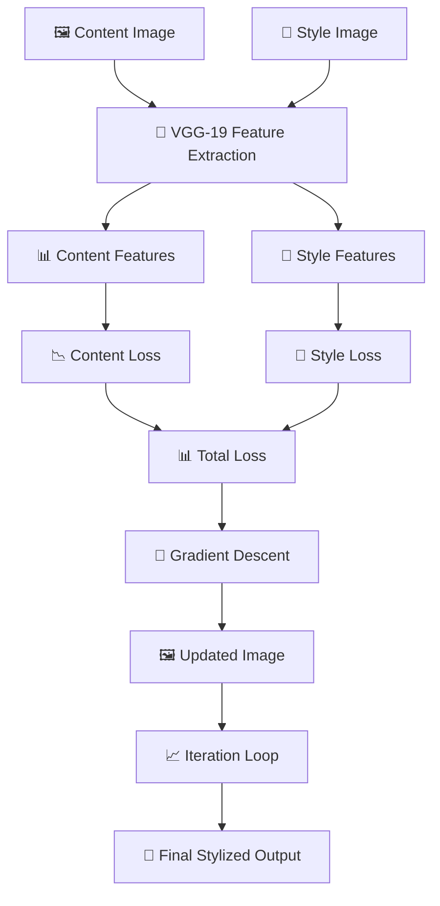

<div align="center">

# 🎨 Neural Style Transfer

# Deep Learning Powered Artistic Image Stylization

## Blend Content. Apply Style. Create Art. 🖼️

</div>

---

<p align="center">


</p>

---

# 📖 Project Description

The **Neural Style Transfer System** is a Python-based deep learning project that artistically reimagines one image using the style of another. It blends the content of a photograph with the style of a painting using a pre-trained VGG-19 convolutional neural network. This technique is part of the field of computer vision and AI-generated art, showcasing how AI can support human creativity and visual aesthetics.

---

# ✨ Key Highlights

- 🎨 Artistic Style Transfer Using VGG-19
- 🖼️ Content + Style Feature Extraction
- 📊 Content & Style Loss Calculation
- 🔄 Iterative Gradient Descent Optimization
- 📈 Visual Progress Monitoring
- 💾 Saves Stylized Output Image
- ⚙️ Adjustable Content & Style Weights
- 🖥️ CPU & GPU Support

---

# 🏗 System Architecture



---

### 🔄 How It Works

1. Load content image and style image.
2. Extract content features using VGG-19 layers.
3. Extract style features using Gram matrices.
4. Initialize target image as a copy of content image.
5. Calculate content loss and style loss.
6. Compute total loss (content_weight × content_loss + style_weight × style_loss).
7. Perform gradient descent to update target image.
8. Repeat for specified iterations.
9. Display progress every 50 iterations.
10. Save final stylized image.

---

# ✨ Core Features

## 🧠 VGG-19 Feature Extraction
- Pre-trained model (no training required)
- Deep feature maps for content
- Gram matrices for style
- Multi-layer style extraction

---

## 📊 Loss Functions

| Loss Type | Purpose |
|:---|:---|
| Content Loss | Preserves image structure |
| Style Loss | Captures artistic style |
| Total Loss | Combined optimization goal |

---

## 🔄 Iterative Optimization
- Gradient descent optimization
- Adjustable iterations
- Progress visualization
- Step-by-step refinement

---

## ⚙️ Adjustable Parameters

| Parameter | Function |
|:---|:---|
| Content Weight | Structure preservation |
| Style Weight | Style intensity |
| Iterations | Quality vs speed trade-off |
| Image Size | Resolution control |

---

# 🛠 Technology Stack

| Layer | Technology |
|:---|:---|
| Programming Language | Python 3.11 |
| Deep Learning | PyTorch |
| Model | VGG-19 (Pre-trained) |
| Image Processing | PIL (Pillow) |
| Visualization | Matplotlib |
| Computations | NumPy |
| Deployment | Local / CLI |
| Version Control | Git & GitHub |

---

# 📂 Project Structure

```text
NEURAL-STYLE-TRANSFER-SYSTEM/
│
├── style_transfer.py                   # Main Application
├── requirements.txt                    # Dependencies
├── README.md                           # Documentation
├── .gitignore                          # Git Ignore
│
├── content.jpg                         # Content Image
├── style.jpg                           # Style Image
└── stylized_output.jpg                 # Final Output
```

---

# 📸 Application Preview


---

# ⚙ Installation

## Prerequisites

- Python 3.11+
- pip

---

### Clone Repository

```bash
git clone https://github.com/Keya3639/NEURAL-STYLE-TRANSFER-SYSTEM.git

cd NEURAL-STYLE-TRANSFER-SYSTEM
```

---

### Install Dependencies

```bash
pip install -r requirements.txt
```

---

### Run Application

```bash
python style_transfer.py
```

---

# 🚀 Demo Workflow

| Step | Action |
|:--:|:---|
| 1 | Load Content Image |
| 2 | Load Style Image |
| 3 | Set Content & Style Weights |
| 4 | Run Style Transfer |
| 5 | Monitor Progress Every 50 Iterations |
| 6 | View Final Stylized Output |
| 7 | Save Result as stylized_output.jpg |

---

# 📈 Advantages

- ✅ High-quality stylization
- ✅ No retraining required
- ✅ Offline support
- ✅ Flexible configuration
- ✅ CPU and GPU support
- ✅ Visually impressive results

---

# ⚠️ Limitations

- Single image pair at a time
- Not optimized for video/animation
- Longer processing on CPU
- No built-in GUI
- Requires basic coding knowledge

---

# 🌟 Real-Time Applications

- 🎨 AI Art Creation
- 📸 Photo Filters
- 🎯 Content Design
- 🎓 Educational Demonstrations
- 🎬 Creative Tools

---

# 🔮 Future Enhancements

| Phase | Features |
|:---|:---|
| Phase 1 | Batch processing support |
| Phase 2 | Video style transfer |
| Phase 3 | Interactive GUI/Web interface |
| Phase 4 | Multi-style support |
| Phase 5 | Mobile and API deployment |

---

# 👩‍💻 Developer

## Keya Das

**MCA (Artificial Intelligence & Data Science)**

🌐 **GitHub**

https://github.com/Keya3639

📧 **Email**

keyakarunamoydas@gmail.com

---

<div align="center">

# 🎨 Neural Style Transfer

### Blend Content. Apply Style. Create Art. 🖼️

<br>

**Built with ❤️ using**

**Python • PyTorch • VGG-19 • PIL • Matplotlib • NumPy**

<br>

</div>
```
